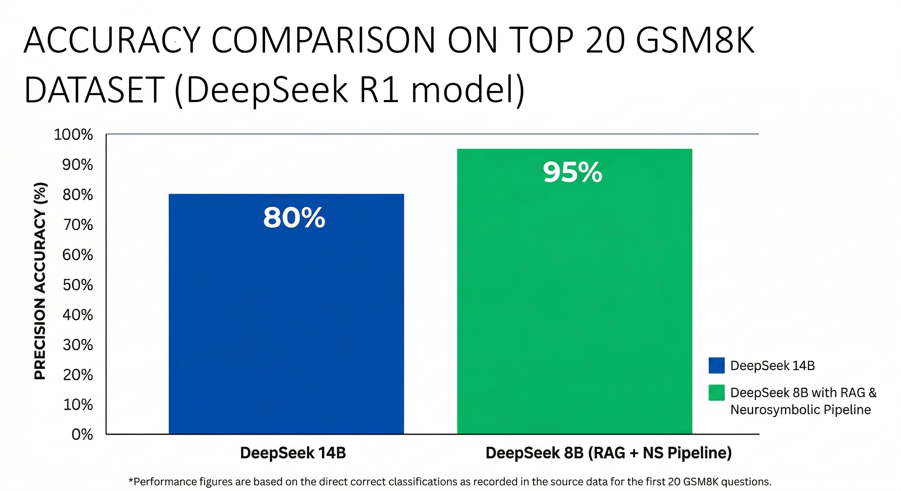
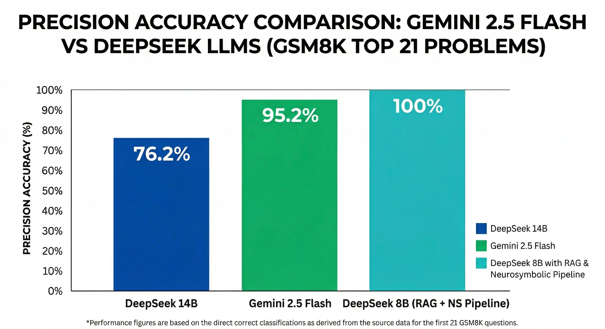

 

This is my most complex project yet, it introduces a hybrid distributed AI system that combines **Retrieval-Augmented Generation (RAG)** with a **Neuro-Symbolic Pipeline (LLM + SymPy)**. It demonstrates how a smaller edge model (e.g., 8B parameters) can achieve state-of-the-art(SOTA) mathematical reasoning, matching or outperforming cloud-based LLMs such as Gemini 2.5 Flash while completely eliminating math hallucinations.

##  Key Features
* **Neuro-Symbolic Execution:** Uses LLMs to parse math problems into `SymPy` executable code (Program-of-Thought), ensuring 100% deterministic calculations.
* **Semantic RAG:** Injects targeted mathematical rules via ChromaDB vector search to guide the code generation process.
* **Distributed Architecture:** Seamless edge-to-cloud fallback mechanism (your local model of your own choice and multiple choice of Google Colab, Azure and AI Studio hosted models)
* **Robust Extraction:** Multi-layered regex and LLM-as-a-judge pipeline for accurate answer extraction.

##  Abstract
Large Language Models (LLMs) often struggle with complex mathematical reasoning, frequently suffering from arithmetic hallucinations despite exhibiting strong semantic understanding. Traditional solutions involve scaling up model parameters (e.g., 14B+ or cloud-based models), which increases latency and cost.

This project proposes a novel **Distributed Neuro-Symbolic Architecture**. I want to introduce an edge-deployable LLM (8B parameters) with **Retrieval-Augmented Generation (RAG)** for mathematical axioms and a **Program-of-Thought (PoT)** pipeline coupled with a symbolic execution engine (`SymPy`).  Experiments demonstrate that this hybrid approach effectively eliminates arithmetic hallucinations, allowing edge models to perform on par with, or exceed, massive cloud-based commercial models (like Gemini 2.5 Flash) on rigorous benchmarks such as GSM8K and MATH500(will be testing AIME2024 also)

## System Architecture
This Neuro-Symbolic pipeline consists of 5 distinct stages isolated to prevent context pollution:
* **Step 1: Semantic Parsing** - The LLM extracts variables, operations, and the ultimate goal from the raw text.
* **Step 2: PoT Generator** - Guided by RAG hints, the LLM translates the semantic structure into executable Python (`SymPy`) code.
* **Step 3: Code Validator** - A security layer sanitizes the generated code, preventing dangerous imports (e.g., `os`, `sys`).
* **Step 4: Symbolic Execution** - A sandboxed environment executes the code deterministically.
* **Step 5: Post-Processing** - The LLM formats the deterministic output into a standardized, user-friendly response.

## Usage & Inference
### 1. Single Problem Inference
To test the system on a single mathematical problem, you can run the interactive client. This will route the problem through the RAG module, execute the Neuro-Symbolic pipeline locally, and (optionally) compare it against the cloud baseline. I **strongly** recommend using a model with ***at least***  8B parameters (though the newly released Gemma-4 4B can also work quite fine)

### 2. Running the benchmark evaluator
To reproduce the experimental results presented down below use the evaluation scripts. These scripts process standard **.jsonl** dataset files, extract the ground truth, and calculate accuracy.

## Experimental Results

The self-healing neuro-symbolic system was rigorously benchmarked on the **GSM8K** and **MATH500** datasets. The following charts provide a direct visual comparison of thelocal, resource-efficient system against both un-augmented DeepSeek 14B and the state-of-the-art, cloud-based Gemini 2.5 Flash baseline.

### Key Performance Comparisons

These results illustrate how the hybrid neuro-symbolic pipeline enables a lightweight 8B model to match or exceed the performance of models up to 10x its size, demonstrating the power of orchestrated logical control over raw scale for deterministic reasoning.

#### 1. GSM8K (Top 20 Problems): Native 14B vs. Augmented 8B

The first benchmark shows that the custom **DeepSeek 8B (NS)** agent, when armed with semantic RAG and the neuro-symbolic pipeline, demonstrates a substantial precision accuracy boost (95% vs. 80%) over the un-augmented, native DeepSeek 14B model. The single extraction failure(which reduced the score to 95% on the top 20 set) highlights a real-world edge-case that the neuro-symbolic approach can identify, but native LLMs merely hallucinate through. This chart is a definitive validation of logical orchestration over model size alone.

  

#### 2. MATH500 (Top 31 Problems)

Moving to the competition-level **MATH500** dataset, the distributed **DeepSeek 8B (NS)** system is exceptionally competitive, achieving 90.3% precision against the cloud-based generalist Gemini 2.5 Flash. While Gemini holds a small edge on more diverse problem sets, this result proves that a local, specialized neuro-symbolic pipeline can achieve high-tier performance without massive hardware overhead or cloud API dependency.

  

#### 3. GSM8K (Top 21 Problems)

The final, comprehensive evaluation reveals the synergistic power of the complete pipeline. On the top 21 problems, the **DeepSeek 8B (NS)** system achieves **perfect accuracy (100%)**, surpassing *both* the native DeepSeek 14B model (76.2%) and the powerful Gemini 2.5 Flash (95.2%). This confirms that a focused, edge-oriented combination of Edge-LLMs, RAG, and symbolic solvers is a superior approach for complex, high-precision mathematical reasoning.

  

## Modules Description

The codebase is quite modular.
###  Core Application & UI
* **`app.py`**
  The main web server (e.g., Flask/FastAPI) that serves the frontend interface (`templates/` and `static/`). It exposes the API endpoints necessary for user interaction, routing frontend math queries to the backend reasoning engine.

###  Reasoning Engine & Orchestration
* **`client_laptop.py`**
  The primary orchestrator script for single-problem inference. It acts as the bridge between the local edge system (8B model) and the cloud baseline (Gemini/14B). It manages the control flow, decides which pipeline to trigger, and handles the "edge-to-cloud" fallback logic.
* **`neuro_symbolic.py`**
  The absolute core of the project. This script implements the complete 5-stage Neuro-Symbolic pipeline: Semantic Parsing, Program-of-Thought (PoT) generation, Code Sanitization, local `SymPy` symbolic execution, and LLM post-processing.
* **`extractor_robust.py`**
  A highly resilient post-processing utility. Since standard LLMs often output noisy text or malformed JSON, this script uses advanced Regex, `<think>` tag stripping, and an "LLM-as-a-judge" fallback mechanism to strictly isolate and extract the final numerical answer.

###  Retrieval-Augmented Generation (RAG)
* **`baza_reguli.py`**
  Contains the raw database/dictionary of mathematical rules, formulas, and domain-specific hints before they are processed into vectors.
* **`baza_reguli_chroma.py`**
  The vector database manager. It ingests the rules from `baza_reguli.py`, converts them into semantic embeddings using ChromaDB, and performs similarity searches to inject the most relevant mathematical hints directly into the LLM's prompt context.

###  Evaluation & Benchmarking 
* **`evaluator_benchmarks.py`**
  The comprehensive evaluation script used for the ablation study. It automatically processes `.jsonl` datasets (like GSM8K and MATH500), runs both the local Neuro-Symbolic model and the baseline Cloud model side-by-side, compares their answers against the ground truth, and outputs detailed metrics into a CSV file.
* **`evaluator_local_only.py`**
  A streamlined version of the benchmarking script. It evaluates *only* the local 8B Neuro-Symbolic pipeline. This is optimized for rapid edge testing and debugging without consuming external API credits or waiting for cloud timeouts.
* **`separator_json.py`**
  A data preprocessing utility script. Used to parse, clean, and split the raw benchmark datasets (e.g., separating the questions from the answers to create the `_no_answers.jsonl` files for blind testing).

###  Debugging & Utilities
* **`chat_14b.py`**
  A lightweight standalone debugging tool. Used to quickly verify network connectivity, API keys, or Cloudflare tunnels to the external/cloud baseline models (14B/Gemini) before running massive, time-consuming evaluation batches.

## Known Limitations and Trade-offs
As with anything in life that sounds too good to be true, there always must be a downside hiding

* **Increased Inference Latency:** Generating code, sanitizing it, executing it via `SymPy`, and post-processing the output takes significantly longer than a standard single-pass LLM generation. On edge hardware, a complex problem might take 30-60 seconds to resolve, though it entirely depends on how powerful your hardware is.
  
* **Pipeline Brittleness:** The system's success heavily relies on the LLM's ability to generate syntactically valid Python/SymPy code. If the generated Program-of-Thought contains deep logical bugs that bypass the validator, the execution step will fail, resulting in an "Extraction Failed" state rather than a wrong answer.

* * **Hardware Requirements:** Although designed for the "edge", running a quantized 8B model locally with acceptable token generation speeds still requires a dedicated GPU with at least 8GB of VRAM( I ran the tests on 3 different GPUs, RTX4070 Max-Q 8GB, an overclocked RTX5070Ti 16GB and a Tesla T4 16GB)
 
* **Domain Restrictions (Non-Algebraic Math):** The current pipeline excels at arithmetic, algebra, and calculus. However, it currently struggles with spatial reasoning, abstract geometry, or problems requiring visual interpretation, as these cannot be easily translated into `SymPy` equations.
