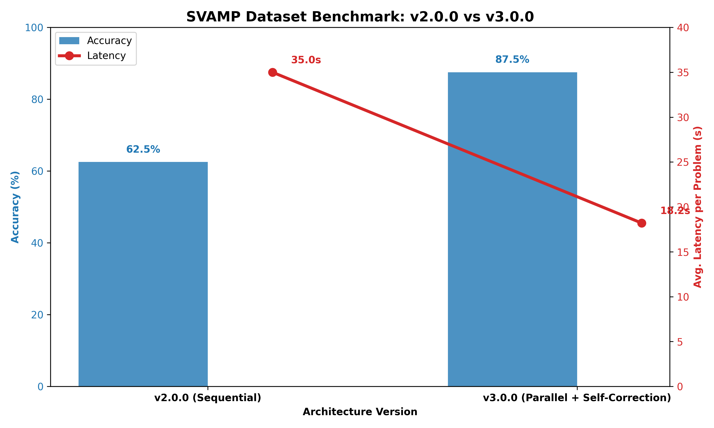
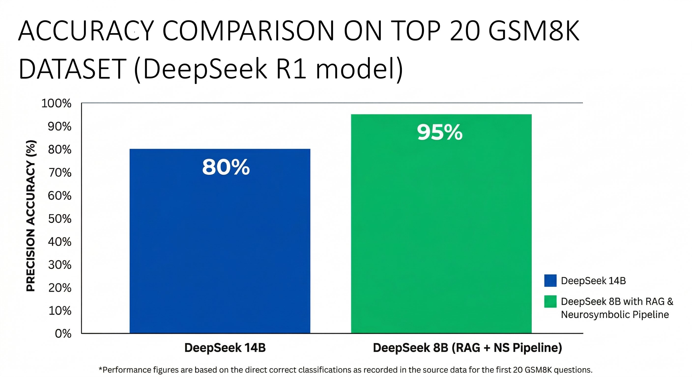
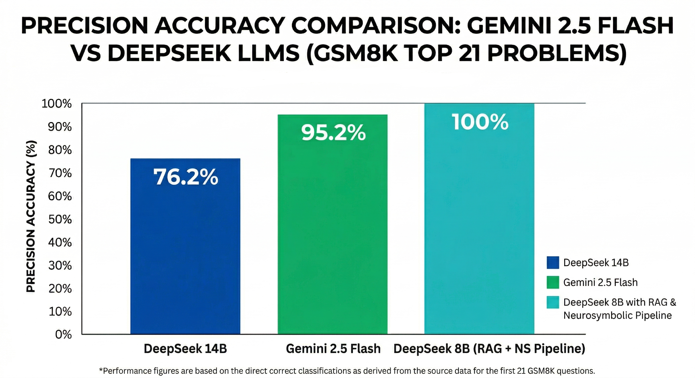
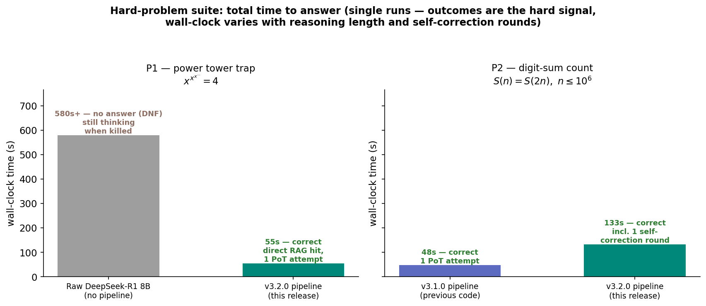
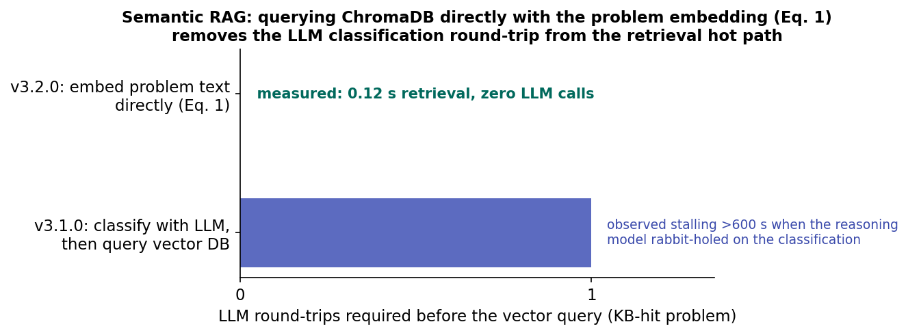
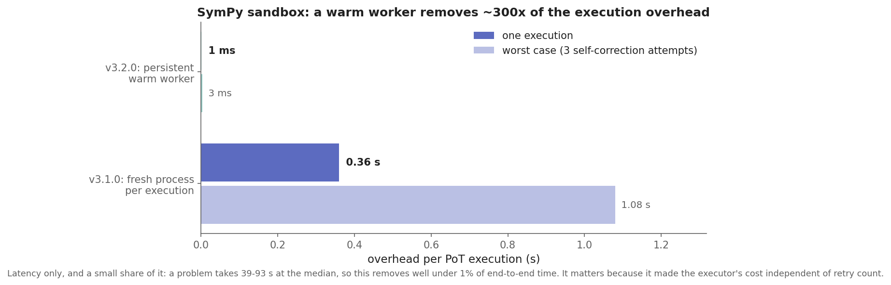

<div align="center">

# Neuro-Symbolic Math Solver


[](https://opensource.org/licenses/MIT)


<br/>

</div>

---

This is my most complex GitHub project yet, exploring hybrid reasoning architectures to completely eliminate computational hallucinations in edge-scale models. The performance metrics demonstrated in the charts below highlight the capabilities of the Release v1.0.0 architecture, where wrapping a compact 8B parameter model in this RAG and neuro-symbolic pipeline yielded massive performance surges, allowing it to compete with and even surpass much larger frontier models.


-----

## Overview (Release v3.0.0)

**Neuro-Symbolic Math Solver** is my research-oriented, web-based artificial intelligence system that integrates the generative reasoning capabilities of Large Language Models (LLMs) with the formal rigor of symbolic mathematics via **SymPy**, augmented by real-time Retrieval-Augmented Generation (RAG).

Developed in the context of my **KES 2026 submission**, the system explores hybrid reasoning architectures to offload rigid arithmetic tasks to a deterministic engine and inject missing parametric knowledge via RAG. This framework empowers compact models (e.g., 8B parameters) to achieve competition-level mathematical deductive capabilities.

**Version 3.0.0 Update:** The architecture has been overhauled for significant latency reduction and accuracy improvements. The RAG retrieval and Semantic Parsing now run in parallel (cutting initial latency by up to 50%), and the execution layer features an active **Self-Correction Loop** that catches SymPy execution errors and prompts the LLM to fix its own code.

**Version 3.1.0 Update (Bring Your Own Key):** The reasoning core is now provider-agnostic. A unified LLM layer routes every call to either a **local Ollama** model (free, no key) or **OpenRouter** (300+ frontier and open models behind a single key). The platform ships with a redesigned *Aurora* interface — a frosted-glass, neon-accented workspace with a live neuro-symbolic pipeline visualization and a built-in **BYOK** settings panel. **API keys never touch the server**: they live in the browser's `localStorage` and are forwarded straight to the provider per request.

**Version 3.2.0 Update (Pipeline Optimization & Paper Alignment):** The neuro-symbolic core was profiled end-to-end and optimized for latency and robustness.

* **Direct-embedding RAG (Eq. 1):** the vector DB is now queried directly with the problem-text embedding — zero LLM round-trips in the retrieval hot path (measured 0.12 s on a knowledge-base hit). The LLM problem-type classifier survives only as a *token-capped* fallback on a miss, so a reasoning model can no longer stall the stage by rabbit-holing (observed >600 s pre-fix).
* **Persistent warm SymPy sandbox:** PoT scripts now execute in a long-lived worker process that is pre-warmed in parallel with the LLM stages (~1 ms per execution vs ~0.36 s for a fresh process spawn, paid on every self-correction attempt). Hung scripts are killed and the worker respawns transparently.
* **P ⊕ H prompting:** the Program-of-Thought generator and the self-correction loop always receive the *original problem statement* alongside the parsed structure and the top-2 retrieved hints, so a lossy semantic parse can no longer silently drop constraints (the paper's "semantic bottleneck" failure mode).
* **English knowledge base:** the 271 mathematical rules are embedded in an English ChromaDB collection matching the language of the GSM8K/MATH500/AIME/SVAMP benchmarks (the legacy collection caused systematic cross-lingual retrieval misses).
* **Provider-layer fixes:** OpenAI/Anthropic SSE streaming repaired, Ollama `thinking` field folded into the uniform `<think>` protocol (reasoning panel now works with modern Ollama), generation no longer truncatable mid-reasoning, SymPy ≥1.13 result formatting fixed, Windows console Unicode crashes in retrieval logging fixed.

The platform is implemented using **Flask** and **Docker**, featuring a purpose-built *Aurora* interface optimized for high-clarity mathematical interaction and explainability.

-----

## Performance Highlights

In my ablation studies evaluated on frontier mathematical benchmarks, wrapping edge-scale models in this neuro-symbolic pipeline yielded significant performance improvements compared to raw baseline executions:

<div align="center">
  
  <br><br>
  
  <br><br>
  
  <br><br>
  
</div>
<br/>

### v3.2.0 Live Hard-Problem Tests

To validate the v3.2.0 optimizations, the pipeline was tested live against problems specifically chosen to be unsolvable by a raw 8B model: a famous semantic trap (the infinite power tower $x^{x^{x^{\cdots}}} = 4$, whose "obvious" answer $\sqrt{2}$ is wrong — no real solution exists) and a counting problem with a tempting-but-false closed form that only real computation can settle ($S(n)=S(2n)$ for $n \le 10^6$; ground truth 65,063 verified by brute force).

<div align="center">
  
  <br><br>
  
  <br><br>
  
</div>
<br/>

* **Power tower trap:** the raw model was still reasoning with no answer after **580 s**; the v3.2.0 pipeline returned the correct `no_solution` in **55 s** — the anti-trap axiom was retrieved by direct embedding match (zero LLM calls) and injected into the PoT prompt.
* **Digit-sum count:** both pipeline versions reach the exact count (65,063) by *executing* a generated SymPy/Python program — knowledge no language model can produce from its weights. The v3.2.0 run additionally exercised the capped-classifier fallback and recovered from a code error via one self-correction round.
* Reproduce locally (needs `ollama serve` + `deepseek-r1:8b`): `python tests/run_one.py "<problem>"` — or run the LLM-free internals check: `python tests/smoke_test_pipeline.py`. Charts are regenerated by `python utils/make_charts_v32.py`.

### Earlier release benchmarks

* **SVAMP Dataset (v3.0.0 Benchmark):** The new parallelized architecture with self-correction achieved an **87.5% accuracy** on sample problem sets while drastically reducing execution latency to an average of **~18s per problem**.
* **AIME 2025 Dataset:** Reached **66.6% accuracy** (20 problems solved out of 30) using an 8B model (compared to a 0% baseline without RAG and symbolic execution).
* **MATH 500 Dataset:** Achieved **93.0% accuracy** on the first 100 problems of this dataset, demonstrating extreme robustness in complex theorem application.
* **Zero Arithmetic Hallucinations:** The execution layer securely handles all mathematical operations, completely eliminating LLM calculation errors.
-----

## Key Contributions

  * **Neuro-Symbolic Reasoning Pipeline**
    1.  **Semantic Parsing** – Extraction of variables, constraints, and objectives.
    2.  **Program-of-Thought (PoT) Generation** – LLM-generated symbolic Python scripts.
    3.  **Deterministic Execution** – Secure, isolated evaluation using `SymPy`.
    4.  **Validation & Result Extraction** – Ensuring strict mathematical correctness.
  * **Hybrid Retrieval-Augmented Generation (RAG)**
      * Local knowledge retrieval via **ChromaDB**.
      * Live web search (DuckDuckGo) to mitigate epistemic constraints and knowledge cutoffs.
  * **Explainable AI Interface ("Focus Mode")**
      * Real-time pipeline streaming and execution logs.
      * High-fidelity LaTeX rendering via MathJax.
      * Expandable reasoning traces for complete error traceability.
  * **Containerized Research Environment**
      * Fully reproducible edge architecture via Docker and `docker-compose`.

-----

## Technology Stack

| Layer | Technology |
| :--- | :--- |
| **Backend** | Flask (Python 3.11) |
| **Frontend** | Vanilla JS, CSS3 (Aurora glassmorphism), MathJax, Marked — Instrument Serif / Hanken Grotesk / JetBrains Mono |
| **Math Engine** | SymPy (Python Runtime) |
| **LLM Runtime** | BYOK — local **Ollama** (default, free) or a cloud model via **OpenRouter**, **OpenAI**, **Anthropic**, or **Google Gemini** (your key, stored only in the browser) |
| **Vector Store** | ChromaDB |
| **Web Retrieval** | DuckDuckGo Search API |

-----

## Bring Your Own API Key (BYOK)

Math-OS is provider-agnostic. Open **Settings** (the gear in the sidebar) and pick how the reasoning core is powered:

| Provider | Key required? | Notes |
| :--- | :--- | :--- |
| **Ollama** | No | Runs models locally and free. Default. Requires a running `ollama serve`. |
| **OpenRouter** | Yes (your own) | One key unlocks 300+ models (DeepSeek-R1, GPT, Claude, Gemini, Llama…). Get a key at [openrouter.ai/keys](https://openrouter.ai/keys). |
| **Google Gemini** | Yes (your own) | Native AI Studio API (e.g. `gemini-2.5-flash`). |
| **OpenAI** | Yes (your own) | Native API (e.g. `gpt-4o-mini`). |
| **Anthropic** | Yes (your own) | Native API (e.g. Claude Sonnet). |

> **Privacy:** your OpenRouter key is stored **only** in your browser's `localStorage` and is sent straight to the provider on each request. It is never persisted, logged, or cached on the server. A deployer *may* optionally set a server-side fallback via the `OPENROUTER_API_KEY` env var (see `.env.example`), but that is off by default.

-----

## Quick Start (Docker)

The fastest path uses a local [Ollama](https://ollama.com/) model (no key). Pull your preferred edge model first — *or skip this entirely and choose OpenRouter with your own key in Settings.*

```bash
ollama pull deepseek-r1:8b
```

### 1\. Clone the Repository

```bash
git clone https://github.com/dbogdanm/Neuro-Symbolic-Math-Solver.git
cd Neuro-Symbolic-Math-Solver
```

### 2\. Build and Launch

```bash
docker-compose up --build
```

### 3\. Access the Application

Open your browser and navigate to:

```text
http://localhost:5000
```

-----

## Manual Setup (Without Docker)

### 1\. Create a Virtual Environment

```bash
python -m venv .venv
source .venv/bin/activate   # Windows: .venv\Scripts\activate
```

### 2\. Install Dependencies

```bash
pip install -r requirements.txt
```

### 3\. Run the Application

```bash
python app.py
```

-----

## Neuro-Symbolic Pipeline Architecture

My system follows a strict deterministic and interpretable reasoning loop to bridge the gap between neural flexibility and symbolic precision:

1.  **Retrieval Phase:** Queries ChromaDB and external web sources to formulate the governing equations.
2.  **Semantic Structuring:** Converts natural language problem statements into strict, structured JSON formats.
3.  **Symbolic Program Synthesis:** Generates executable SymPy code via LLM reasoning based on retrieved context.
4.  **Execution & Verification:** Runs the generated code in an isolated environment, validates outputs, and falls back to natural language reasoning if unrecoverable logic errors occur.

-----

## Requirements

  * Docker & Docker Compose *(recommended for isolation)*
  * Ollama running locally (mapped to `host.docker.internal:11434` in Docker)
  * **Recommended Models:**
      * `deepseek-r1:8b` (default)
      * `llama3:8b-instruct`

-----

## Model Providers (Bring Your Own Key)

The engine is provider-agnostic. Pick a provider in the in-app **Settings** panel:

| Provider | Key required | Notes |
| :--- | :---: | :--- |
| **Ollama** | No | Local, free, default. Runs any model you've pulled. |
| **OpenRouter** | Yes | One key, 300+ models (many free). |
| **OpenAI** | Yes | Native GPT models. |
| **Anthropic** | Yes | Native Claude models. |
| **Google Gemini** | Yes | AI Studio key. |

Keys are entered in the browser and forwarded per request — they are **never**
stored on the server. A deployer can optionally provide a server-side fallback
key via environment variables (see `.env.example`); BYOK keys always take
precedence.

-----

## Development

Install the dev dependencies, then run the linter and the test suite:

```bash
pip install -r requirements-dev.txt
ruff check .          # lint
pytest                # unit + route tests (no Ollama / network needed)
```

GitHub Actions runs `ruff` and `pytest` on every push and pull request
(`.github/workflows/ci.yml`).

A reproducibility script for the SVAMP benchmark is included:

```bash
python tests/eval_svamp_batch.py --limit 20 --provider ollama --model deepseek-r1:8b
```

-----

## Security & Privacy

* **Code execution.** To eliminate arithmetic hallucinations, the pipeline runs
  LLM-generated SymPy code. It executes in a **separate process with a hard
  timeout** (process isolation), but this is **not** a security sandbox — the
  code runs with full Python builtins. The system is designed as a **local,
  single-user research tool**. Do not expose the `/api/neuro_symbolic` endpoint
  to untrusted users without adding OS-level isolation (a locked-down container
  with no network and a read-only filesystem) and restricting builtins/imports.
* **API keys.** BYOK keys live only in the browser's `localStorage` and are sent
  straight to the chosen provider per request. Nothing is logged or written to
  disk server-side.

-----

## License

**Copyright (c) 2026 DINU BOGDAN**

This project is licensed under the MIT License.

Permission is hereby granted, free of charge, to any person obtaining a copy of this software and associated documentation files (the "Software"), to deal in the Software without restriction, including without limitation the rights to use, copy, modify, merge, publish, distribute, sublicense, and/or sell copies of the Software, and to permit persons to whom the Software is furnished to do so, subject to the following conditions:

The above copyright notice and this permission notice shall be included in all copies or substantial portions of the Software.

> THE SOFTWARE IS PROVIDED "AS IS", WITHOUT WARRANTY OF ANY KIND, EXPRESS OR IMPLIED, INCLUDING BUT NOT LIMITED TO THE WARRANTIES OF MERCHANTABILITY, FITNESS FOR A PARTICULAR PURPOSE AND NONINFRINGEMENT. IN NO EVENT SHALL THE AUTHORS OR COPYRIGHT HOLDERS BE LIABLE FOR ANY CLAIM, DAMAGES OR OTHER LIABILITY, WHETHER IN AN ACTION OF CONTRACT, TORT OR OTHERWISE, ARISING FROM, OUT OF OR IN CONNECTION WITH THE SOFTWARE OR THE USE OR OTHER DEALINGS IN THE SOFTWARE.

---
