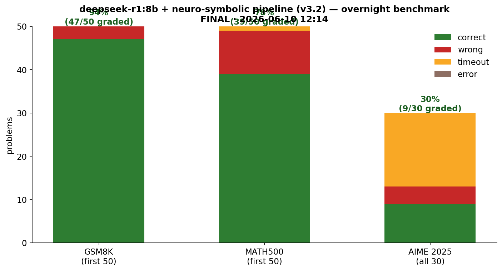
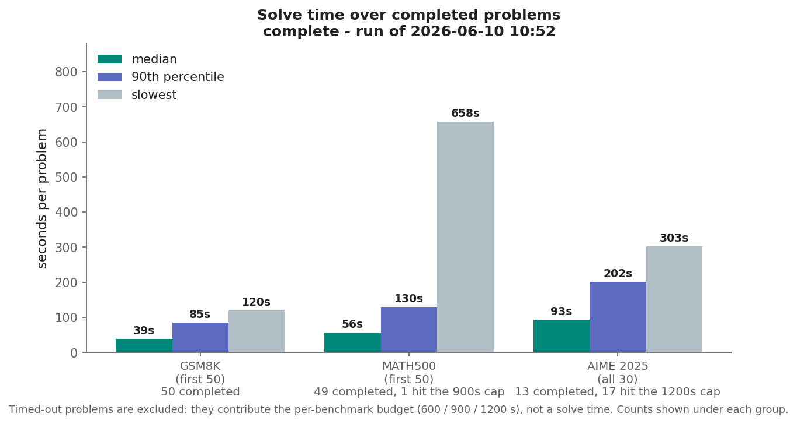
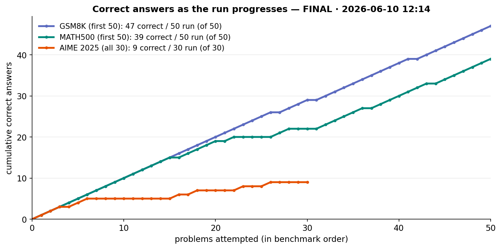
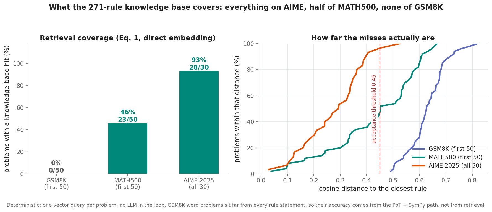
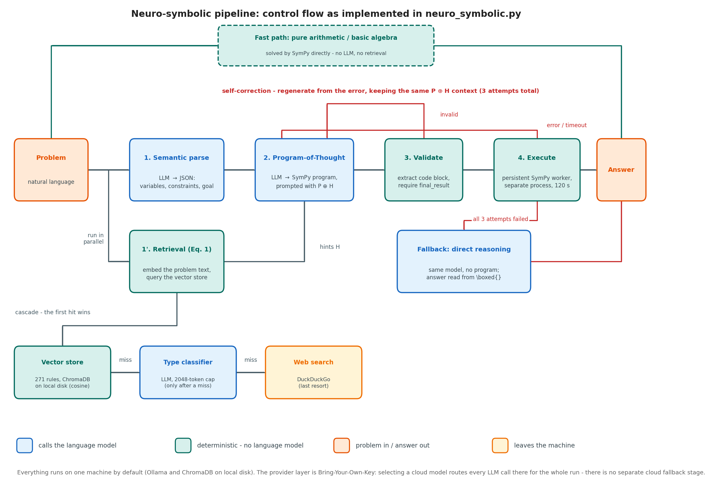

<div align="center">

# Neuro-Symbolic Math Solver


[](https://opensource.org/licenses/MIT)


<br/>

</div>

---

This project explores hybrid reasoning architectures that move arithmetic out of the language model entirely: rather than asking an 8B model to compute, the pipeline has it *write a program*, and a deterministic SymPy engine executes it. Arithmetic is therefore not a source of error — though semantic parsing, program generation and retrieval all still are, and the [Results](#results) section reports where they fail. On the benchmarks measured here, the pipeline takes `deepseek-r1:8b` to 94% on GSM8K and 90% on MATH500.


-----

## Overview

**Neuro-Symbolic Math Solver** is my research-oriented, web-based artificial intelligence system that integrates the generative reasoning capabilities of Large Language Models (LLMs) with the formal rigor of symbolic mathematics via **SymPy**, augmented by real-time Retrieval-Augmented Generation (RAG).

Developed in the context of my **KES 2026 submission**, the system explores hybrid reasoning architectures to offload rigid arithmetic tasks to a deterministic engine and inject missing parametric knowledge via RAG. This framework empowers compact models (e.g., 8B parameters) to achieve competition-level mathematical deductive capabilities.

**Version 3.0.0 Update:** The architecture has been overhauled for significant latency reduction and accuracy improvements. The RAG retrieval and Semantic Parsing now run in parallel (cutting initial latency by up to 50%), and the execution layer features an active **Self-Correction Loop** that catches SymPy execution errors and prompts the LLM to fix its own code.

**Version 3.1.0 Update (Bring Your Own Key):** The reasoning core is now provider-agnostic. A unified LLM layer routes every call to either a **local Ollama** model (free, no key) or **OpenRouter** (300+ frontier and open models behind a single key). The platform ships with a redesigned *Aurora* interface — a frosted-glass, neon-accented workspace with a live neuro-symbolic pipeline visualization and a built-in **BYOK** settings panel. **API keys never touch the server**: they live in the browser's `localStorage` and are forwarded straight to the provider per request.

**Version 3.2.0 Update (Pipeline Optimization & Paper Alignment):** The neuro-symbolic core was profiled end-to-end and optimized for latency and robustness.

* **Direct-embedding RAG (Eq. 1):** the vector DB is now queried directly with the problem-text embedding — zero LLM round-trips in the retrieval hot path (measured 0.12 s on a knowledge-base hit). The LLM problem-type classifier survives only as a *token-capped* fallback on a miss, so a reasoning model can no longer stall the stage by rabbit-holing (observed >600 s pre-fix). The index is built in **cosine** space to match Eq. 1 (ChromaDB's default is squared L2; on normalized embeddings the two rank identically but differ by a factor of two, so the thresholds in the code and in the paper are now the same quantity).
* **Persistent warm SymPy sandbox:** PoT scripts now execute in a long-lived worker process that is pre-warmed in parallel with the LLM stages (~1 ms per execution vs ~0.36 s for a fresh process spawn, paid on every self-correction attempt). Hung scripts are killed and the worker respawns transparently.
* **P ⊕ H prompting:** the Program-of-Thought generator *and* the self-correction loop both receive the original problem statement alongside the parsed structure and the top-2 retrieved hints, so a lossy semantic parse can no longer silently drop constraints (the paper's "semantic bottleneck" failure mode). A corrector given only the traceback re-derives the program from less context than the generator had, which is how a self-correction round loses a constraint.
* **English knowledge base:** the 271 mathematical rules are embedded in an English ChromaDB collection matching the language of the GSM8K/MATH500/AIME/SVAMP benchmarks (the legacy collection caused systematic cross-lingual retrieval misses). Measured coverage of that base is reported under [Results](#results) — it is not uniform across benchmarks.
* **Provider-layer fixes:** OpenAI/Anthropic SSE streaming repaired, Ollama `thinking` field folded into the uniform `<think>` protocol (reasoning panel now works with modern Ollama), generation no longer truncatable mid-reasoning, SymPy ≥1.13 result formatting fixed, Windows console Unicode crashes in retrieval logging fixed.

The platform is implemented using **Flask** and **Docker**, featuring a purpose-built *Aurora* interface optimized for high-clarity mathematical interaction and explainability.

-----

## Results

Every number below comes from `tests/results/overnight_results.jsonl`: one
complete, resumable run of 130 problems — GSM8K (first 50), MATH500 (first 50)
and AIME 2025 (all 30) — driving `deepseek-r1:8b` through the v3.2.0 pipeline on
the reference workstation (RTX 5070 Ti, Ryzen 5 7600X, 32 GB RAM). The model's
raw answer is recorded for every problem, so any figure here can be re-checked,
and the grader can be re-run over the stored answers without spending GPU time
again.

<div align="center">
  
</div>

| Benchmark | Accuracy | Correct | Wrong | Timed out |
|---|---|---|---|---|
| GSM8K (first 50) | **94%** | 47 | 3 | 0 |
| MATH500 (first 50) | **90%** | 45 | 4 | 1 |
| AIME 2025 (all 30) | **30%** | 9 | 4 | 17 |

Accuracy counts a timeout as a failure. The per-problem wall-clock budget is
600 s on GSM8K, 900 s on MATH500 and 1200 s on AIME; AIME's 17 timeouts are the
dominant failure mode there, not wrong answers, so the ceiling on that benchmark
is compute, not reasoning.

Answers are graded by `tests/grading.py`, which compares mathematical
equivalence rather than strings — SymPy prints `6 - 5*I` where the label writes
`6 - 5i`, and `[3, 5, 7]` where the label writes `3, 5, 7`. Re-grade a stored
run with `python tests/regrade.py`.

<div align="center">
  
  <br><br>
  
</div>

### What the retrieval stage actually contributes

Running Eq. 1 — the direct-embedding query — over all 130 problems, with no LLM
in the loop, gives a deterministic measure of knowledge-base coverage:

<div align="center">
  
</div>

| Benchmark | Problems with a KB hit | Median cosine distance |
|---|---|---|
| GSM8K | **0 / 50 (0%)** | 0.63 |
| MATH500 | 23 / 50 (46%) | 0.45 |
| AIME 2025 | 28 / 30 (93%) | 0.30 |

The retrieval stage never fires on GSM8K. Grade-school word problems are prose
about shopping and ages; as text they sit far from any statement of a
mathematical rule, and a prescriptive hint pulled from the closest one would
poison the generated program rather than help it. So the 94% on GSM8K is
attributable to the Program-of-Thought + SymPy execution path alone — retrieval
is what carries the competition-level problems, where it fires on 93% of AIME.
Reproduce with `python utils/make_rag_coverage_chart.py` (seconds, no LLM).

### v3.2.0 engineering changes

These two figures are a two-problem diagnostic suite, not a benchmark. They are
single runs, and they show that a failure mode was removed — not that accuracy
improved by a measurable margin. Problems were chosen to be unsolvable by a raw
8B model: a semantic trap (the infinite power tower $x^{x^{x^{\cdots}}} = 4$,
whose "obvious" answer $\sqrt{2}$ is wrong — no real solution exists) and a
counting problem with a tempting-but-false closed form that only real
computation can settle ($S(n)=S(2n)$ for $n \le 10^6$; ground truth 65,063,
verified by brute force).

<div align="center">
  
  <br><br>
  
</div>

* **Power tower trap:** the raw model was still reasoning with no answer after **580 s**; the v3.2.0 pipeline returned the correct `no_solution` in **55 s** — the anti-trap axiom was retrieved by direct embedding match (zero LLM calls) and injected into the PoT prompt.
* **Digit-sum count:** both pipeline versions reach the exact count (65,063) by *executing* a generated SymPy/Python program — a value no language model can produce from its weights. v3.2.0 is *slower* here (133 s vs 48 s) because it spent one self-correction round recovering from a code error; both are correct.
* **Retrieval hot path:** v3.1.0 ran an LLM problem-type classification before every vector query, and was observed stalling for over 600 s when the reasoning model rabbit-holed into solving the problem instead of classifying it. v3.2.0 queries ChromaDB directly with the problem embedding — measured at 0.12 s on a knowledge-base hit, with zero LLM round-trips — and falls back to a 2048-token-capped classifier only on a miss.
* **Sandbox:** the per-execution overhead is real but small in context (0.36 s against a 39–93 s median solve time). Its value is that the executor's cost no longer scales with the number of self-correction attempts.

### Reproducing

```bash
python tests/smoke_test_pipeline.py          # LLM-free internals check
python tests/run_one.py "<problem>"          # one problem (needs ollama serve)
python tests/overnight_bench.py              # the full 130-problem run
python tests/regrade.py                      # re-score stored answers
python utils/make_overnight_charts.py        # benchmark figures
python utils/make_rag_coverage_chart.py      # retrieval-coverage figure
python utils/make_charts_v32.py              # engineering figures
```

### Limitations

Stated here rather than left for a reader to find:

* **One run, one model.** Every accuracy figure is a single pass of
  `deepseek-r1:8b` at temperature > 0. No variance estimate, no repeated runs,
  and no confidence intervals; on n=50 the standard error is roughly 3–4 points.
* **Benchmark prefixes, not samples.** The first 50 problems of GSM8K and
  MATH500 are used, which is a deterministic and inspectable choice, but it is
  not a random sample and MATH500 is not stratified by difficulty level.
* **No external baseline in this release.** Earlier hand-made comparisons
  against DeepSeek-14B and Gemini 2.5 Flash have been withdrawn: they came from
  different runs, disagreed with each other, and had no recorded results behind
  them. See `Charts/archive_superseded/README.md` for what they claimed and how
  to regenerate them properly.
* **AIME is compute-bound here.** 17 of 30 problems hit the 1200 s budget; the
  30% figure is a floor for this configuration, not the pipeline's ceiling.
* **The sandbox is process isolation, not a security boundary.** See the
  SECURITY MODEL note in `neuro_symbolic.py`.

-----

## Key Contributions

  * **Neuro-Symbolic Reasoning Pipeline**
    1.  **Semantic Parsing** – Extraction of variables, constraints, and objectives.
    2.  **Program-of-Thought (PoT) Generation** – LLM-generated symbolic Python scripts.
    3.  **Deterministic Execution** – Secure, isolated evaluation using `SymPy`.
    4.  **Validation & Result Extraction** – Ensuring strict mathematical correctness.
  * **Hybrid Retrieval-Augmented Generation (RAG)**
      * Local knowledge retrieval via **ChromaDB**.
      * Live web search (DuckDuckGo) to mitigate epistemic constraints and knowledge cutoffs.
  * **Explainable AI Interface ("Focus Mode")**
      * Real-time pipeline streaming and execution logs.
      * High-fidelity LaTeX rendering via MathJax.
      * Expandable reasoning traces for complete error traceability.
  * **Containerized Research Environment**
      * Fully reproducible edge architecture via Docker and `docker-compose`.

-----

## Technology Stack

| Layer | Technology |
| :--- | :--- |
| **Backend** | Flask (Python 3.11) |
| **Frontend** | Vanilla JS, CSS3 (Aurora glassmorphism), MathJax, Marked — Instrument Serif / Hanken Grotesk / JetBrains Mono |
| **Math Engine** | SymPy (Python Runtime) |
| **LLM Runtime** | BYOK — local **Ollama** (default, free) or a cloud model via **OpenRouter**, **OpenAI**, **Anthropic**, or **Google Gemini** (your key, stored only in the browser) |
| **Vector Store** | ChromaDB |
| **Web Retrieval** | DuckDuckGo Search API |

-----

## Bring Your Own API Key (BYOK)

Math-OS is provider-agnostic. Open **Settings** (the gear in the sidebar) and pick how the reasoning core is powered:

| Provider | Key required? | Notes |
| :--- | :--- | :--- |
| **Ollama** | No | Runs models locally and free. Default. Requires a running `ollama serve`. |
| **OpenRouter** | Yes (your own) | One key unlocks 300+ models (DeepSeek-R1, GPT, Claude, Gemini, Llama…). Get a key at [openrouter.ai/keys](https://openrouter.ai/keys). |
| **Google Gemini** | Yes (your own) | Native AI Studio API (e.g. `gemini-2.5-flash`). |
| **OpenAI** | Yes (your own) | Native API (e.g. `gpt-4o-mini`). |
| **Anthropic** | Yes (your own) | Native API (e.g. Claude Sonnet). |

> **Privacy:** your OpenRouter key is stored **only** in your browser's `localStorage` and is sent straight to the provider on each request. It is never persisted, logged, or cached on the server. A deployer *may* optionally set a server-side fallback via the `OPENROUTER_API_KEY` env var (see `.env.example`), but that is off by default.

-----

## Quick Start (Docker)

The fastest path uses a local [Ollama](https://ollama.com/) model (no key). Pull your preferred edge model first — *or skip this entirely and choose OpenRouter with your own key in Settings.*

```bash
ollama pull deepseek-r1:8b
```

### 1\. Clone the Repository

```bash
git clone https://github.com/dbogdanm/Neuro-Symbolic-Math-Solver.git
cd Neuro-Symbolic-Math-Solver
```

### 2\. Build and Launch

```bash
docker-compose up --build
```

### 3\. Access the Application

Open your browser and navigate to:

```text
http://localhost:5000
```

-----

## Manual Setup (Without Docker)

### 1\. Create a Virtual Environment

```bash
python -m venv .venv
source .venv/bin/activate   # Windows: .venv\Scripts\activate
```

### 2\. Install Dependencies

```bash
pip install -r requirements.txt
```

### 3\. Run the Application

```bash
python app.py
```

-----

## Neuro-Symbolic Pipeline Architecture

<div align="center">
  
</div>

The colouring is the claim: blue stages call the language model, teal stages are
fully deterministic. Arithmetic never happens in a blue box.

1. **Fast path** — pure arithmetic and basic algebra are recognised by pattern
   and handed straight to SymPy. No model call, no retrieval.
2. **Semantic parse (stage 1) and retrieval (stage 1') run in parallel**, on one
   thread pool, and are joined before generation. Retrieval is a cascade: the
   problem text is embedded and matched against the local vector store first
   (Eq. 1, no model call); only on a miss does a token-capped classifier get
   involved, and only after *that* misses is the web queried.
3. **Program-of-Thought (stage 2)** — the model writes a SymPy program. It is
   prompted with P ⊕ H: the original problem statement, the parsed structure,
   *and* the retrieved hints, so a lossy parse cannot drop a constraint.
4. **Validate (stage 3)** — the code block is extracted and checked for
   `final_result` *before* anything runs.
5. **Execute (stage 4)** — the program runs in a persistent SymPy worker in a
   separate process under a 120 s cap.
6. **Self-correction** — a validation failure or an execution error sends the
   model back to step 3 with the traceback plus the same P ⊕ H context, up to
   three attempts in total.
7. **Fallback** — if all three fail, the same model answers in natural language
   and the answer is read out of `oxed{}`.

There is no cloud fallback stage. Ollama and ChromaDB both run locally by
default; the provider layer is Bring-Your-Own-Key, so selecting a cloud model
routes *every* LLM call there for the whole run rather than adding a tier. The
only component that reaches the network on its own is the DuckDuckGo search at
the end of the retrieval cascade.

The diagram is generated from a script (`python utils/make_architecture_diagram.py`),
which prints the function behind every box so the figure and the code can be
checked against each other.

-----

## Requirements

  * Docker & Docker Compose *(recommended for isolation)*
  * Ollama running locally (mapped to `host.docker.internal:11434` in Docker)
  * **Recommended Models:**
      * `deepseek-r1:8b` (default)
      * `llama3:8b-instruct`

-----

## Model Providers (Bring Your Own Key)

The engine is provider-agnostic. Pick a provider in the in-app **Settings** panel:

| Provider | Key required | Notes |
| :--- | :---: | :--- |
| **Ollama** | No | Local, free, default. Runs any model you've pulled. |
| **OpenRouter** | Yes | One key, 300+ models (many free). |
| **OpenAI** | Yes | Native GPT models. |
| **Anthropic** | Yes | Native Claude models. |
| **Google Gemini** | Yes | AI Studio key. |

Keys are entered in the browser and forwarded per request — they are **never**
stored on the server. A deployer can optionally provide a server-side fallback
key via environment variables (see `.env.example`); BYOK keys always take
precedence.

-----

## Development

Install the dev dependencies, then run the linter and the test suite:

```bash
pip install -r requirements-dev.txt
ruff check .          # lint
pytest                # unit + route tests (no Ollama / network needed)
```

GitHub Actions runs `ruff` and `pytest` on every push and pull request
(`.github/workflows/ci.yml`).

Every benchmark goes through one harness and one grader, so two runs can never
disagree because they were scored differently. SVAMP ships as a dataset but is
not part of the default run; ask for it by name:

```bash
python tests/overnight_bench.py deepseek-r1:8b svamp
```

Repository layout:

| Path | Purpose |
|---|---|
| `neuro_symbolic.py` | the pipeline: stages, self-correction loop, sandbox worker |
| `llm.py` | provider-agnostic LLM layer (Ollama, OpenRouter, Gemini, OpenAI, Anthropic) |
| `rules_base.py`, `math_rules.py` | the 271-rule knowledge base and its ChromaDB index |
| `tests/overnight_bench.py` | benchmark orchestrator (resumable, one problem per subprocess) |
| `tests/grading.py` | the only answer grader; `tests/regrade.py` re-scores a stored run |
| `utils/fetch_benchmarks.py` | rebuilds `tests/datasets/` from the source datasets |
| `utils/make_*.py` | one script per figure, sharing `utils/chart_style.py` |

-----

## Security & Privacy

* **Code execution.** To keep arithmetic out of the model, the pipeline runs
  LLM-generated SymPy code. It executes in a **separate process with a hard
  timeout** (process isolation), but this is **not** a security sandbox — the
  code runs with full Python builtins. The system is designed as a **local,
  single-user research tool**. Do not expose the `/api/neuro_symbolic` endpoint
  to untrusted users without adding OS-level isolation (a locked-down container
  with no network and a read-only filesystem) and restricting builtins/imports.
* **API keys.** BYOK keys live only in the browser's `localStorage` and are sent
  straight to the chosen provider per request. Nothing is logged or written to
  disk server-side.

-----

## License

**Copyright (c) 2026 DINU BOGDAN**

This project is licensed under the MIT License.

Permission is hereby granted, free of charge, to any person obtaining a copy of this software and associated documentation files (the "Software"), to deal in the Software without restriction, including without limitation the rights to use, copy, modify, merge, publish, distribute, sublicense, and/or sell copies of the Software, and to permit persons to whom the Software is furnished to do so, subject to the following conditions:

The above copyright notice and this permission notice shall be included in all copies or substantial portions of the Software.

> THE SOFTWARE IS PROVIDED "AS IS", WITHOUT WARRANTY OF ANY KIND, EXPRESS OR IMPLIED, INCLUDING BUT NOT LIMITED TO THE WARRANTIES OF MERCHANTABILITY, FITNESS FOR A PARTICULAR PURPOSE AND NONINFRINGEMENT. IN NO EVENT SHALL THE AUTHORS OR COPYRIGHT HOLDERS BE LIABLE FOR ANY CLAIM, DAMAGES OR OTHER LIABILITY, WHETHER IN AN ACTION OF CONTRACT, TORT OR OTHERWISE, ARISING FROM, OUT OF OR IN CONNECTION WITH THE SOFTWARE OR THE USE OR OTHER DEALINGS IN THE SOFTWARE.

---
